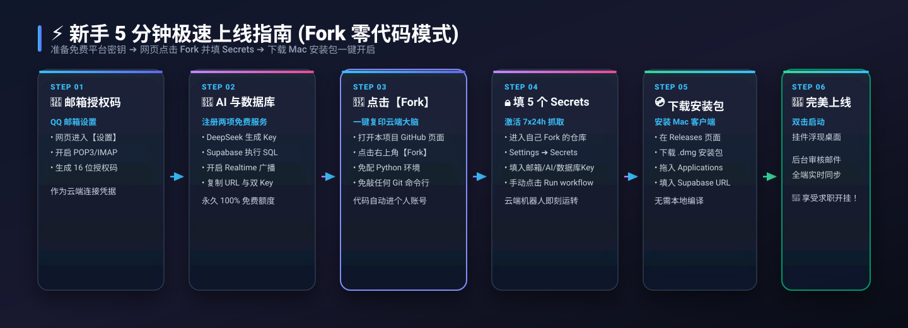

<div align="center">

# 🚀 OfferPilot (招聘智能助手 V3.0)

**一个云原生、高颜值、多端实时同步的个人求职全流程自动化管理体系**

[](LICENSE)
[](https://www.python.org/)
[](https://supabase.com/)
[](https://www.deepseek.com/)
[]()
[](.github/workflows/sync.yml)

<br/>

[核心特性](#-核心架构特性) • [系统架构](#-系统架构全景) • [新手部署全攻略 (必读)](#-从零到一新手极速部署指南-fork-零代码模式) • [客户端交互使用指引](#-客户端日常交互使用指引) • [状态生命周期](#-任务状态全生命周期流转) • [工程结构](#-工程目录结构) • [安全隔离](#-开源安全与机密隔离)

</div>

---

## 📖 项目简介

在求职季，海量的招聘进度通知（笔试测评、AI面试、业务面试、Offer录取、资料补充）分散在各大邮件中，极易被日常邮件淹没、遗漏或手忙脚乱。

**OfferPilot (招聘智能助手 V3.0)** 彻底推翻了传统本地客户端的常驻轮询模式，重构为 **“云端大脑 7x24h 自动化提取 + Supabase 实时流转中枢 + Mac 原生透明毛玻璃挂件 + 网页端审核大厅与进度看板”** 的全自动闭环架构。

全流程遵循 **真·零运维成本 (100% Free Tier 免费额度)** 与 **机密凭据绝对物理隔离** 原则。

---

## 📐 系统架构全景


---

## 🛠️ 从零到一新手极速部署指南 (Fork 零代码模式)

> 💡 **无需本地配置复杂的 Python 开发环境，无需手动敲 Git 命令上传代码！**  
> 只要在网页上点击 **【Fork】一键派生**，即可立刻激活专属于您个人的 7x24h 云端抓取机器人！



---

### 🌟 阶段一：准备三大免费云端平台密钥 (约 2 分钟)

#### 1. 📧 获取个人邮箱 IMAP 授权码 (以 QQ 邮箱为例)
* 登录网页版 QQ 邮箱 ➡️ 点击上方 **【设置】** ➡️ **【账户】**；
* 向下滚动找到 **POP3/IMAP/SMTP/Exchange/CardDAV/CalDAV服务**；
* 开启 **`POP3/SMTP服务`** 与 **`IMAP/SMTP服务`**；
* 点击 **【生成授权码】**，按提示发送短信即可获取一段 **16 位字母授权码**（保存好备用）。

#### 2. 🤖 获取 DeepSeek AI API Key
* 登录 [DeepSeek 开放平台](https://platform.deepseek.com/) ➡️ 进入 **【API Keys】**；
* 点击 **【创建 API key】**，复制生成的以 `sk-` 开头的密钥字符串（新用户赠送免费 Token，解析几千封邮件仅需几毛钱）。

#### 3. ⚡️ 创建免费 Supabase 云数据库 (1分钟搞定)
* 登录 [Supabase 官网](https://supabase.com/)，点击 **【New Project】** 创建一个免费数据库项目；
* 进入项目左侧导航栏的 **【SQL Editor】**，粘贴以下一键初始化建表代码并点击 **【Run】**：

```sql
-- 1. 创建招聘任务表
CREATE TABLE tasks (
    id TEXT PRIMARY KEY,
    company TEXT,
    time TEXT,
    type TEXT,
    subject TEXT,
    notes TEXT,
    urgent BOOLEAN DEFAULT FALSE,
    status TEXT DEFAULT 'pending', -- pending(待审核) | approved(已通过) | completed(已完成) | rejected(已忽略)
    is_deleted BOOLEAN DEFAULT FALSE,
    created_at TIMESTAMPTZ DEFAULT NOW(),
    updated_at TIMESTAMPTZ DEFAULT NOW()
);

-- 2. 创建增量同步书签表
CREATE TABLE sync_state (
    key TEXT PRIMARY KEY,
    last_uid BIGINT DEFAULT 0,
    updated_at TIMESTAMPTZ DEFAULT NOW()
);

-- 3. 初始化全局同步书签
INSERT INTO sync_state (key, last_uid) VALUES ('email_sync', 0) ON CONFLICT DO NOTHING;

-- 4. 开启 WebSocket Realtime 实时全端广播
ALTER PUBLICATION supabase_realtime ADD TABLE tasks;

-- 5. 开启 RLS 行级安全策略 (保障公开访问安全)
ALTER TABLE tasks ENABLE ROW LEVEL SECURITY;
ALTER TABLE sync_state ENABLE ROW LEVEL SECURITY;
CREATE POLICY "Allow public read tasks" ON tasks FOR SELECT USING (true);
CREATE POLICY "Allow public update tasks" ON tasks FOR UPDATE USING (true);
CREATE POLICY "Allow public read sync_state" ON sync_state FOR SELECT USING (true);
```

* 进入项目 **Project Settings ➡️ API**，复制以下 3 个核心凭证：
  * **Project URL**（如 `https://xxxx.supabase.co`）
  * **`anon` `public` key**（客户端公开公钥，如 `sb_publishable_...`）
  * **`service_role` `secret` key**（云端超级写入私钥，如 `sb_secret_...`）

---

### ☁️ 阶段二：在 GitHub 网页一键 Fork 并激活云端机器人 (约 2 分钟)

```
[ 本项目 GitHub 主页 ]
         ⬇️ 点击右上角【Fork】按钮 (一键派生到个人账号)
[ 属于您自己的个人仓库: 你的用户名/OfferPilot ]
         ⬇️ 配置 5 个 Actions Secrets 密码
[ 🎉 您的专属云端大脑开始 7x24h 自动工作！]
```

1. **一键 Fork 仓库**：
   * 打开本项目 GitHub 页面，点击右上角的 **【Fork】** 按钮，按默认设置点击 **【Create fork】**；
2. **填入 5 个机密密钥 (Secrets)**：
   * 在您刚刚 Fork 出来的个人仓库中，点击顶部 **【Settings】** ➡️ 左侧菜单 **【Secrets and variables】** ➡️ **【Actions】**；
   * 点击绿色的 **【New repository secret】**，依次添加以下 5 个机密：

| 机密名称 (Secret Name) | 应该填入的值 (Secret Value) | 来源说明 |
| :--- | :--- | :--- |
| **`EMAIL_USER`** | 您的邮箱地址（如 `12345678@qq.com`） | 个人邮箱账号 |
| **`EMAIL_AUTH_CODE`** | 刚才生成的 16 位邮箱授权码 | 邮箱 IMAP 授权码 |
| **`DEEPSEEK_API_KEY`** | 以 `sk-` 开头的 DeepSeek Key | AI 大模型密钥 |
| **`SUPABASE_URL`** | Supabase 项目 Project URL | 数据库 HTTPS 地址 |
| **`SUPABASE_SERVICE_ROLE_KEY`** | Supabase 的 `service_role` secret key | 数据库超级写私钥 |

> [!TIP]
> **首次测试云端抓取**：配置完成后，点击仓库顶部的 **【Actions】** 标签 ➡️ 点击左侧的 **Recruitment Email Sync** ➡️ 点击右侧 **【Run workflow】** 即可手动立即触发一次云端抓取。通常 8 秒内即可在 Supabase 看到新邮件入库！

---

### 💻 阶段三：下载 Mac 客户端一键开箱即用 (约 1 分钟)

#### 1. 下载并安装 Mac App
* 在本项目的 **[Releases 发行版页面](../../releases)** 下载最新的 **`OfferPilot-v3.0.0-macOS.dmg`** 安装包；
* 双击打开 DMG，将 **`OfferPilot.app`** 拖拽到“应用程序 (Applications)”文件夹。

#### 2. 可视化配置向导 (仅需一次)
* 首次打开软件，界面会自动浮现优雅的 **毛玻璃设置向导**（也可随时在挂件右上角点击 ⚙️ 设置，或在网页端 **[http://127.0.0.1:5555/](http://127.0.0.1:5555/)** 配置）；
* 直接粘贴您的 **Supabase Project URL** 与 **`anon` 公开公钥**，点击【⚡️ 保存并立即连接】即可！
* 配置自动持久化保存到 `~/.config/recruitment_assistant/config.json`，软件升级覆盖亦不丢配置。

---

## 🎮 客户端日常交互使用指引

OfferPilot 针对 macOS 系统深度调优，带来了极其自然与丝滑的日常操作体验：

### 🔄 1. 双击开关机制（极简 Toggle 控制）
* **双击打开**：未运行时，双击 `OfferPilot.app`（或双击开关应用），桌面右上角即刻浮现毛玻璃挂件，本地 Web 管理服务同步拉起，并发送系统通知：`🟢 OfferPilot：已在桌面启动`；
* **再双击关闭**：在运行状态下，再次双击 `OfferPilot.app`（或开关应用），系统将**毫秒级彻底退出全部后台 Python 进程与 Web 服务**，并发送通知：`🔴 OfferPilot：已完全关闭`。

### 🖥️ 2. 挂件操作与分层常驻
* **⚙️ 设置数据库**：点击挂件右上角齿轮，可随时呼出配置窗口修改 Supabase 凭据；
* **📊 管理大厅**：点击右上角看板图标，直接在浏览器中打开审核大厅（[http://127.0.0.1:5555/](http://127.0.0.1:5555/)）；
* **✕ 仅收起挂件**：点击挂件右上角 `✕`，仅收起/隐藏桌面挂件，**后台 Web 管理大厅保持常驻可用**；
* **✓ 标记完成**：点击待办卡片右侧的勾选按钮，任务状态毫秒级流转为已完成并折叠归档。

---

## 🔄 任务状态全生命周期流转


---

## 📂 工程目录结构

```text
拉取招聘信息/
├── ☁️ cloud/                      # 【云端抓取服务】
│   └── worker.py                 # 云端邮件提取与 DeepSeek AI 解析引擎 (由 GitHub Actions 调用)
│
├── 💻 client/                     # 【客户端与本地服务】
│   ├── main.py                   # Mac 原生透明桌面挂件宿主 (PyWebView + Cocoa 层级调优)
│   ├── server.py                 # 本地轻量静态 Web 服务 (统一动态读取/注入用户配置)
│   ├── widget/                   # 桌面透明挂件前端 (直连云端 + Realtime 监听 + 首次启动向导)
│   │   ├── index.html
│   │   ├── style.css
│   │   ├── app.js
│   │   └── supabase.js           # 零依赖自研轻量 Supabase 通信 SDK
│   └── admin/                    # 审核管理大厅与求职看板前端 (http://127.0.0.1:5555/)
│       ├── index.html
│       ├── style.css
│       ├── app.js
│       └── supabase.js
│
├── 🛠️ scripts/                    # 【自动化与运维脚本】
│   ├── toggle.sh                 # 桌面挂件一键启动 / 关闭脚本
│   ├── start_web.sh              # 纯 Web 独立控制台启动脚本
│   └── build_mac_app.sh          # 独立 OfferPilot.app 与 .dmg 安装镜像自动化构建打包脚本
│
├── 📖 docs/                       # 【设计文档与设计切图】
│   ├── architecture_plan.md      # V3.0 跨端云原生架构设计实施方案
│   └── assets/                   # 高清矢量架构图 (SVG) 与 Apple AppIcon.icns
│
├── .github/workflows/
│   └── sync.yml                  # ☁️ GitHub Actions 自动化定时工作流
├── ⚡️ 招聘助手开关.app             # 💻 macOS 桌面快捷双击开关程序
├── ⚙️ config.example.json         # 📄 公开配置样例模板
├── 📦 requirements.txt           # 📦 客户端极简 Python 依赖 (仅 pywebview, flask, pyobjc)
├── 🙈 .gitignore                 # 🔒 Git 忽略规则 (严格隔离私密 config.json)
└── 📄 README.md                  # 📖 项目总览与使用说明
```

---

## 🔒 开源安全与机密隔离

本项目严格遵循开源社区最高安全规范：

1. **凭证物理隔离**：
   * 邮箱授权码与 DeepSeek API Key **仅保存在 GitHub Secrets** 中，绝对不落盘、不提交 Git。
2. **本地配置受忽略保护**：
   * 本地真实的 `config.json` 已写入 [`.gitignore`](.gitignore)，开源上传时永远不会包含个人数据库与连接信息。
3. **数据库行级安全 (RLS)**：
   * 客户端公开公钥仅允许安全地读取任务和更新状态，彻底杜绝物理删库、删表或篡改越权。

---

## 🛠️ 技术栈清单

* **云端抓取与 AI**：GitHub Actions, Python 3.11, IMAPlib, BeautifulSoup4, DeepSeek API (OpenAI SDK)
* **数据库与实时中枢**：Supabase (PostgreSQL), PostgREST Gateway, Phoenix Channel WebSocket
* **桌面端宿主**：Python 3, PyWebView, PyObjC (Cocoa / AppKit / Quartz)
* **前端交互界面**：Vanilla HTML5, Modern CSS3 (Glassmorphism), ES6+ JavaScript

---

## 📜 开源许可证

本项目采用 [MIT License](LICENSE) 许可证，欢迎自由修改、分发与二次开发。
