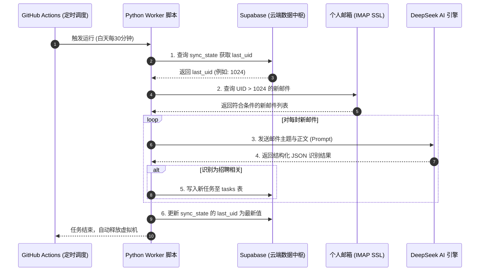
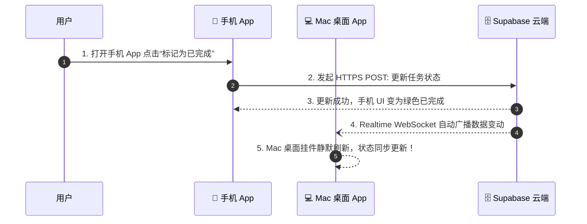

# 招聘智能助手 V3.0：双端独立 App 跨端云原生架构设计与实施计划书

---

## 摘要 (Executive Summary)

本项目旨在将现有的“单机本地 Python 挂件脚本”升级为**“独立 Mac 桌面客户端 + 独立手机端 App (iOS / Android) + 云端数据实时同步”**的现代化跨端应用体系。

本架构方案严格遵循以下四大核心设计原则：
1. **真·零运维成本 (100% Zero-Cost)**：全链路使用顶级云厂商的永久免费额度（Free Tier），不需要购买任何云服务器或域名。
2. **端云分离与数据安全 (Security First)**：云端负责 7x24h 自动化抓取与 AI 提取，各端 App 仅作为数据呈现与交互终端；通过 API 鉴权机制隔离数据库核心凭证，彻底杜绝数据泄露隐患。
3. **纯粹的双端独立体验 (Dual Standalone Apps)**：Mac 端为免终端运行的独立 `.app` 桌面挂件；手机端为可独立安装运行的原生/混合 App，无需依赖任何第三方消息推送中转。
4. **状态持久化与防重复消耗 (Stateful Incremental Sync)**：云端持久化增量拉取进度书签（`last_uid`），精准调用 AI，防止 Token 浪费与邮件重复处理。

---

## 一、 系统整体架构蓝图 (System Architecture Blueprint)

系统由 **“1 个云端自动化大脑 + 1 个云端数据/API 中枢 + 2 个独立客户端应用”** 构成。

```mermaid
graph TD
    subgraph ☁️ 云端自动化大脑 (GitHub Actions 定时触发 - 永久免费)
        Worker[Python Worker 自动化脚本\n白天 08:00~22:30 每30分钟运行]
        Worker -->|1. 查询增量进度| DB_State[(Supabase: sync_state 表\n记录 last_uid)]
        Worker -->|2. IMAP SSL 连接| Mail(个人邮箱 QQ / 163 等)
        Worker -->|3. 发送邮件内容| AI(DeepSeek AI 引擎)
        AI -->|4. 返回结构化 JSON| Worker
        Worker -->|5. 写入新任务| DB_Tasks[(Supabase: tasks 表\n中心化任务数据)]
        Worker -->|6. 更新最新 last_uid| DB_State
    end

    subgraph 🗄️ 云端数据与安全 API 中枢 (Supabase BaaS)
        DB[(PostgreSQL 数据库\n+ 自动生成安全 HTTPS RESTful API\n+ Realtime 实时数据监听)]
    end

    subgraph 💻 Mac 独立桌面 App
        MacApp[Mac 桌面挂件 / 管理看板\n独立 .app 安装包] -->|HTTPS REST API 读写\n+ WebSocket 实时订阅| DB
    end

    subgraph 📱 手机 独立 App (iOS / Android)
        MobileApp[手机端独立 App\n随时随地状态流转 / 审核管理] -->|HTTPS REST API 读写\n+ WebSocket 实时订阅| DB
    end
```

---

## 二、 零成本技术栈选型与对比 (Tech Stack & Cost Breakdown)

| 架构层级 | 选型方案 | 费用明细 | 选型理由与技术优势 |
| :--- | :--- | :--- | :--- |
| **云端数据与 API** | **Supabase (PostgreSQL)** | **永久 0 元** (免费额度 500MB，支持 50,000 月活用户) | 1. 自动生成标准安全的 **HTTPS RESTful API**，省去自建后端服务器。<br>2. 支持 **Realtime**（数据变动毫秒级推送到 Mac 和手机 App）。<br>3. 内置 **Row Level Security (RLS)** 权限隔离，App 内只放公开公钥（Anon Key），安全无忧。 |
| **后台自动化调度** | **GitHub Actions** (私有仓库) | **永久 0 元** (每月免费赠送 2,000 分钟运行时间) | 1. 采用智能 Cron 策略（`*/30 0-14 * * *`），仅在白天工作时段运行，每月仅耗费 ~850 分钟（< 免费额度 45%）。<br>2. 无需本地电脑常驻开机，关机时云端仍自动抓取。 |
| **AI 结构化解析** | **DeepSeek API** | **极低成本 / 赠送额度** (百万 Token 仅需几毛钱) | 结合增量 `last_uid` 书签机制，每次仅解析新增招聘邮件，杜绝重复计费。 |
| **💻 Mac 独立客户端** | **PyWebView / py2app / Tauri** | **永久 0 元** (本地编译打包) | 1. 继承当前项目极具特色的透明桌面挂件与毛玻璃 UI。<br>2. 剥离本地后台轮询，打包为独立 `.app`，双击直接运行，告别终端命令行。 |
| **📱 手机独立客户端** | **Flutter / Capacitor (跨端框架)** | **永久 0 元** (开源生态) | 1. **方案 A (推荐)**：使用 Capacitor 将响应式 Web 直接打包为 iOS/Android 原生 App。<br>2. **方案 B**：使用 Flutter 编写纯原生移动端 UI，体验极致流畅。 |

---

## 三、 数据模型与安全访问设计 (Data Schema & Security)

### 1. 云端数据表结构设计

#### 表 1：`tasks`（招聘任务数据表）
| 字段名 | 类型 | 约束 / 默认值 | 描述 |
| :--- | :--- | :--- | :--- |
| `id` | `TEXT` | `PRIMARY KEY` | 邮件唯一 UID（用于去重） |
| `company` | `TEXT` | `NOT NULL` | 公司名称（如：字节跳动、阿里巴巴） |
| `time` | `TEXT` | `NOT NULL` | 面试/笔试时间（如：2026-05-20 14:00 或 待定） |
| `type` | `TEXT` | `NOT NULL` | 任务类型（如：线上面试、测评、Offer发放） |
| `urgent` | `BOOLEAN`| `DEFAULT false` | 是否为紧急任务 |
| `status` | `TEXT` | `DEFAULT 'pending'` | 任务状态：`pending` (待办/待处理), `completed` (已完成/归档), `ignored` (已忽略/不展示) |
| `created_at` | `TIMESTAMPTZ` | `DEFAULT NOW()` | 任务创建时间 |
| `completed_at` | `TIMESTAMPTZ` | `NULLABLE` | 任务完成时间 |

#### 表 2：`sync_state`（抓取同步状态书签表）
| 字段名 | 类型 | 约束 / 默认值 | 描述 |
| :--- | :--- | :--- | :--- |
| `key` | `TEXT` | `PRIMARY KEY` | 固定值 `'email_sync'` |
| `last_uid` | `BIGINT` | `DEFAULT 0` | 上次成功处理的最大邮件 UID |
| `updated_at` | `TIMESTAMPTZ` | `DEFAULT NOW()` | 最近一次同步成功时间 |

---

### 2. 双端 App 零风险安全鉴权模型

```
┌────────────────────────────────────────────────────────────┐
│                    GitHub Actions (云端 Worker)            │
│  环境变量配置：                                              │
│  - SUPABASE_SERVICE_ROLE_KEY (超级写权限，不外泄)           │
│  - EMAIL_USER & EMAIL_AUTH_CODE                            │
│  - DEEPSEEK_API_KEY                                        │
└─────────────────────────────┬──────────────────────────────┘
                              │ 拥有写入与更新权限
                              ▼
                ┌───────────────────────────┐
                │    Supabase PostgreSQL    │
                │  开启 Row Level Security  │
                └─────────────▲─────────────┘
                              │
          ┌───────────────────┴───────────────────┐
          │ 安全 HTTPS API (仅携带公开 Anon Key)   │
          │                                       │
 ┌────────┴────────┐                     ┌────────┴────────┐
 │   💻 Mac App    │                     │   📱 手机 App   │
 │   (客户端安装包) │                     │   (客户端安装包) │
 └─────────────────┘                     └─────────────────┘
```

* **客户端安全隔离**：Mac 和手机 App 中**仅存放公开的 Anon Public Key**。
* **权限策略（RLS Policy）**：
  * `SELECT`：允许客户端拉取任务列表。
  * `UPDATE`：允许客户端修改 `status` 字段（完成/忽略）。
  * `DELETE / DROP`：**完全禁止**客户端执行删表或删库操作。
  * **结论**：即使 App 被反编译或网络被抓包，任何人也无法破坏数据库或越权篡改。

---

## 四、 核心业务交互时序 (Interaction Sequences)

### 1. 云端 7x24h 自动化邮件抓取时序


### 2. 双端 App 实时同步与操作时序


---

## 五、 项目开发进度与实施路线图 (Project Progress & Roadmap)

### 📊 当前整体开发进度看板 (Overall Progress)

| 阶段 | 模块内容 | 状态 | 完成时间 | 核心成果 |
| :--- | :--- | :---: | :---: | :--- |
| **阶段一** | **云端数据库与 API 初始化** | ✅ **100% 已完成** | 2026-08-20 | Supabase 建表、RLS 安全规则、Realtime 开启、历史数据迁移成功。 |
| **阶段二** | **后台自动化抓取上云** | ✅ **100% 已完成** | 2026-08-20 | `worker.py` 部署、GitHub Actions 定时激活、5 项 Secrets 配置、实测 8 秒自动化入库。 |
| **阶段三** | **Mac 独立桌面挂件改造** | ⏳ **进行中 (下一步)** | - | 前端直连 Supabase、剥离本地抓取线程、打包独立 `.app`。 |
| **阶段四** | **手机端独立 App 构建** | 📋 **待开始** | - | 移动端 UI 适配、跨端工程打包 (Android `.apk` / iOS 真机)。 |

---

### 📝 详细任务进展清单 (Detailed Task Checklist)

#### ✅ 阶段一：云端数据库与 API 初始化 (已全部完成)
- [x] **云端项目创建**：创建免费 Supabase 项目并获取 `Project URL` 与 API Keys。
- [x] **数据表结构设计**：
  - [x] `tasks` 表：支持 `id`, `company`, `time`, `type`, `subject`, `notes`, `urgent`, `status`, `is_deleted`, `created_at`, `updated_at`。
  - [x] `sync_state` 书签表：支持 `key`, `last_uid`, `updated_at`。
- [x] **安全策略配置 (RLS)**：开启 Row Level Security，配置客户端仅允许 `SELECT`, `INSERT`, `UPDATE`，关闭危险物理删除。
- [x] **实时广播通道**：执行 `ALTER PUBLICATION supabase_realtime ADD TABLE tasks` 开启 WebSocket 实时变动监听。
- [x] **历史数据迁移**：运行迁移脚本，将本地原有的 9 条任务及初始 UID 书签成功导入 Supabase。
- [x] **客户端鉴权验证**：使用公开 `Publishable Key` 成功通过 HTTPS API 读取云端任务。

#### ✅ 阶段二：后台抓取逻辑上云 (已全部完成)
- [x] **Worker 脚本编写**：提炼并重构 `worker.py`，支持环境变量读取、增量 UID 书签推进、DeepSeek 结构化解析。
- [x] **GitHub Actions 定时配置**：编写 `.github/workflows/sync.yml`，设定工作时间定时策略（`*/30 0-14 * * *`）。
- [x] **云端机密配置 (Secrets)**：在 GitHub 仓库中配置 5 项核心机密（`EMAIL_USER`, `EMAIL_AUTH_CODE`, `DEEPSEEK_API_KEY`, `SUPABASE_URL`, `SUPABASE_SERVICE_ROLE_KEY`）。
- [x] **代码仓库推送**：将工作流与 Worker 脚本成功推送至 GitHub `main` 分支。
- [x] **云端端到端实测通过**：触发云端 Actions 运行，8 秒内成功解析新邮件（网易校招自动入库、反诈资讯自动过滤、书签自动推进至 1097）。

#### ⏳ 阶段三：Mac 独立桌面挂件改造 (下一步任务)
- [ ] **挂件前端对接 API**：修改 `web/app.js`，将原本的本地 `/api/tasks` 改造为直接对接 Supabase HTTPS RESTful API。
- [ ] **状态流转功能升级**：实现点击“✓”标记完成（`status='completed'`）与“×”逻辑删除（`is_deleted=true`）。
- [ ] **管理看板对接**：修改 `web_admin/app.js`，适配云端多维度招聘进度聚合。
- [ ] **Mac 端轻量化**：移除本地 Python `fetch_loop` 邮件轮询线程，实现零 CPU 占用与零发热。
- [ ] **独立客户端打包**：使用打包工具生成独立的 `招聘助手.app`，双击即开，摆脱终端运行。

#### 📋 阶段四：手机端独立 App 构建 (未来规划)
- [ ] **移动端 UI 界面适配**：设计符合手机操作习惯的卡片视图、待办筛选栏与操作手势。
- [ ] **多端数据实时同步联调**：验证 Mac 端勾选完成时，手机端实时无感同步；手机端操作时，Mac 挂件同步刷新。
- [ ] **移动端安装包打包交付**：生成 Android `.apk` 安装包并提供 iOS 本地真机安装配置。

---

## 六、 运维保障与异常处理机制 (Reliability & Failover)

1. **邮件拉取防重机制**：
   * 采用 `UID` 双重校验：除了在 `sync_state` 记录 `last_uid`，插入 `tasks` 表时利用 `id` 作为主键。遇到重复邮件时使用 `upsert` 操作，保证幂等性。
2. **AI 解析异常降级**：
   * 当 DeepSeek API 发生网络波动或超时报错时，脚本自动退出，**不推进 `last_uid` 进度**，确保下次运行时自动重试该邮件，不遗漏任何求职通知。
3. **断网与离线体验**：
   * Mac 和手机 App 内置本地轻量缓存（Local Storage / SQLite），弱网或离线状态下打开 App 依然可浏览已有招聘任务。

---

## 七、 总结

本设计书将原先分散的本地脚本全面升级为**云原生、高安全性、双端独立、永久 0 成本**的现代化商业级软件架构。各项技术选型均具备极高的可行性与稳定性。
